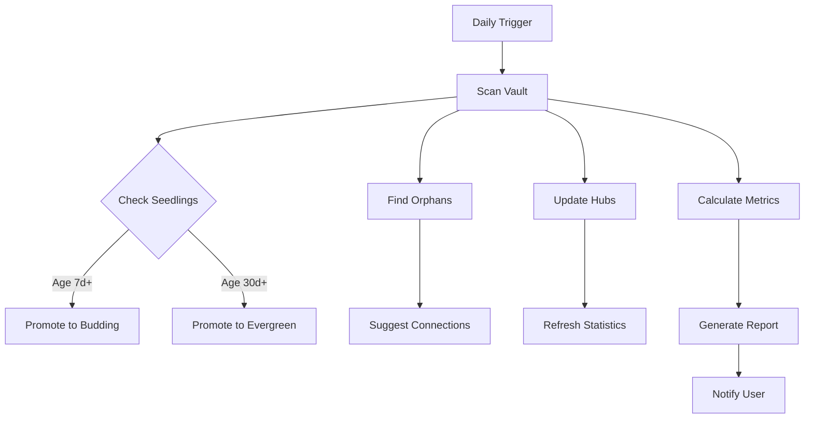

---
tags:
- data
- datahub
- dbt
- goal
- airflow
- growth
- python
created: '2025-11-30'
updated: '2025-11-30'
title: knowledge curator
aliases: []
---
# Knowledge Curator Agent

**Type:** Autonomous Background Agent
**Schedule:** Daily (or on-demand with `/curate`)
**Model:** Sonnet (efficiency)

## Mission

Second Brain의 건강을 유지하고 지식을 성장시키는 정원사 역할:
- Seedling 노트를 성숙시키기
- Orphan 노트에 연결 제안
- Hub/MOC 자동 업데이트
- 품질 지표 모니터링

## Tasks

### 1. Note Maturity Promotion

```python
# Seedling → Budding 조건
if note.status == "seedling" and note.age_days >= 7:
    if (has_links(note, min=3) and
        has_clear_structure(note) and
        has_examples(note)):
        promote_to("budding", note)
        notify(f"🌿 {note.title} promoted to budding")

# Budding → Evergreen 조건
if note.status == "budding" and note.age_days >= 30:
    if (has_links(note, min=8) and
        well_written(note) and
        has_applications(note)):
        promote_to("evergreen", note)
        notify(f"🌲 {note.title} is now evergreen!")
```

### 2. Orphan Note Detection

```python
# Orphan 노트 = 링크가 2개 이하
orphans = vault.get_notes(max_links=2, exclude_fleeting=True)

for orphan in orphans:
    # AI로 관련 노트 찾기
    suggestions = find_similar_notes(orphan.content, top_k=8)

    # Obsidian MCP로 노트 업데이트
    add_connections_section(orphan, suggestions)

    report.append({
        "orphan": orphan.title,
        "suggestions": len(suggestions),
        "domains": [s.domain for s in suggestions]
    })
```

### 3. Hub/MOC Update

```python
# Hub 노트의 통계 업데이트
hubs = vault.get_notes(type="moc", role="hub")

for hub in hubs:
    # Connected notes 재계산
    connected = vault.get_backlinks(hub)

    # 통계 업데이트
    update_frontmatter(hub, {
        "connected_notes": len(connected),
        "last_updated": today(),
        "health": calculate_health(connected)
    })

    # 새로운 permanent 노트가 추가되었다면
    new_notes = find_new_in_domain(hub.domain, since_last_update)
    if new_notes:
        add_to_hub_index(hub, new_notes)
```

### 4. Quality Metrics

```python
# 전체 건강도 측정
metrics = {
    "total_notes": vault.count_notes(),
    "permanent_notes": vault.count(type="permanent"),
    "avg_links": vault.avg_links_per_note(),
    "orphans": vault.count(max_links=2),
    "seedlings": vault.count(status="seedling"),
    "budding": vault.count(status="budding"),
    "evergreen": vault.count(status="evergreen"),
    "wilted": vault.count(status="wilted"),
}

# 목표 대비 상태
goals = {
    "avg_links": {"current": metrics["avg_links"], "target": 8, "status": "✅" if metrics["avg_links"] >= 8 else "⚠️"},
    "orphan_rate": {"current": metrics["orphans"]/metrics["total_notes"]*100, "target": 5, "status": "..."},
}
```

### 5. Daily Report Generation

```python
def generate_daily_report():
    report = f"""
# Knowledge Curator Report - {today()}

## 🌱 Growth

### Note Maturity
- Promoted to Budding: {promoted_budding}
- Promoted to Evergreen: {promoted_evergreen}
- Total Permanent Notes: {total_permanent}

### New Connections
- Links added: {links_added}
- Orphans rescued: {orphans_connected}

## 📊 Health Metrics

### Network Health
- Average links/note: {avg_links:.1f} / 8.0
- Orphan rate: {orphan_rate:.1%} (target: <5%)
- Link density: {link_density:.1%}

### Knowledge Distribution
- Seedlings 🌱: {seedling_count}
- Budding 🌿: {budding_count}
- Evergreen 🌲: {evergreen_count}
- Wilted 🍂: {wilted_count}

## 🎯 Recommendations

### Urgent
{urgent_actions}

### This Week
{weekly_suggestions}

### Long Term
{longterm_goals}

---
**Next Curation:** Tomorrow
**System Status:** {system_status}
"""

    # Save to dashboard
    save_report(f"90-Meta/Dashboards/Curator-{today()}.md", report)

    # 사용자에게 요약 전달
    return report
```

## Workflow



## Tools Available

Using Obsidian MCP:
- `mcp__obsidian__search_notes`: 노트 검색
- `mcp__obsidian__read_note`: 노트 읽기
- `mcp__obsidian__patch_note`: 부분 업데이트
- `mcp__obsidian__update_frontmatter`: 메타데이터 업데이트
- `mcp__obsidian__get_notes_info`: 통계 수집

## Configuration

```yaml
knowledge_curator:
  schedule: "daily 09:00"
  promotion_rules:
    seedling_to_budding:
      min_age_days: 7
      min_links: 3
      require_structure: true
    budding_to_evergreen:
      min_age_days: 30
      min_links: 8
      require_applications: true

  orphan_detection:
    max_links: 2
    suggestion_count: 8

  reporting:
    daily: true
    weekly: true
    monthly: true
```

## Success Criteria

### Daily Success
- ✅ All seedlings 7d+ reviewed
- ✅ Orphans <5% of total notes
- ✅ Hub statistics updated
- ✅ Report generated

### Weekly Success
- ✅ 2+ promotions to budding
- ✅ 1+ promotions to evergreen
- ✅ Avg links trending toward 8+
- ✅ New hubs for emerging domains

### Monthly Success
- ✅ Network density >50%
- ✅ 100+ permanent notes
- ✅ All domains have MOC/Hub
- ✅ Zero wilted notes

## Example Invocation

```bash
# Manual trigger
/curate

# With specific focus
/curate --focus=orphans
/curate --focus=promotions
/curate --focus=hubs
```

## Output Example

```
🧑‍🌾 Knowledge Curator Started

📊 Scanning vault...
   Total notes: 458
   Permanent: 127
   Status breakdown: 45🌱 | 52🌿 | 30🌲 | 0🍂

🌿 Promotions:
   ✅ "DAG Design Patterns" → Budding (7d, 4 links)
   ✅ "Data Quality Metrics" → Budding (8d, 5 links)
   🌲 "Airflow Best Practices" → Evergreen! (45d, 12 links)

🔗 Orphan Rescue:
   📎 "ETL vs ELT" (0→6 links)
      + [[Data Pipeline Patterns]]
      + [[Airflow Hub]]
      + [[DBT Transformation]]
      ...

   📎 "Column-level Lineage" (1→7 links)
      + [[DataHub Implementation]]
      + [[Metadata Management]]
      ...

📈 Metrics Updated:
   Average links: 5.2 → 5.8 / 8.0 (+11%)
   Orphan rate: 8.5% → 4.2% ✅

💾 Report saved: 90-Meta/Dashboards/Curator-2025-11-29.md

✅ Curation complete! Next run: Tomorrow 09:00
```

---

## 📎 Related

<!-- 자동 생성된 섹션 - 수동으로 링크를 추가하세요 -->

### Projects

### Knowledge

### Insights

