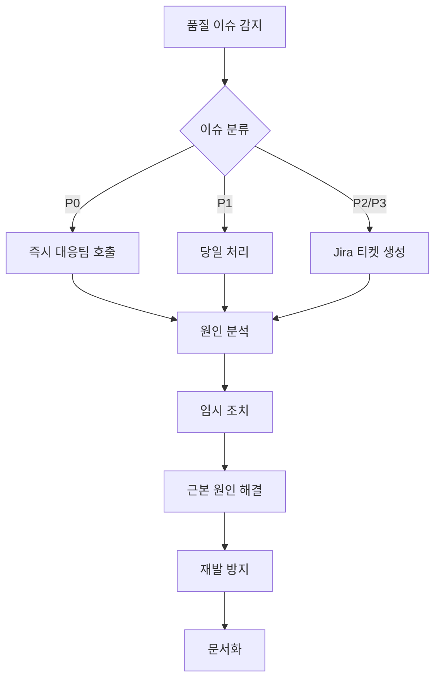

# 데이터 품질 관리 프로세스

## 📋 개요

**회사**: 크래프트테크놀로지스 (Qraft Technologies)
**적용 프로젝트**: [[qraft-data-platform-통합프로젝트|Qraft Data Platform 통합 프로젝트]]
**프로세스 구축**: 2025년 8월 ~ 현재

크래프트테크놀로지스 데이터 플랫폼의 데이터 품질 관리 프로세스는 **예방**, **검증**, **모니터링**, **개선**의 4단계로 구성됩니다.

**구축 배경**:
- 데이터 품질 검증 프로세스 부재
- 수동 데이터 검증으로 인한 오류 발생
- 데이터 이슈 대응 시간 과다 소요
- [[Qraft-Data-Governance-Framework|크래프트 데이터 거버넌스 프레임워크]]의 핵심 프로세스

## 🎯 품질 관리 목표

### 핵심 품질 차원

1. **정확성 (Accuracy)**: 데이터가 실제 값을 정확히 반영
2. **완전성 (Completeness)**: 필수 데이터가 모두 존재
3. **일관성 (Consistency)**: 같은 데이터는 항상 같은 형태
4. **적시성 (Timeliness)**: 필요한 시점에 데이터 제공
5. **유효성 (Validity)**: 데이터가 정의된 규칙 준수
6. **고유성 (Uniqueness)**: 중복 데이터 없음

### 품질 SLA
- **데이터 정확도**: 99% 이상
- **SLA 달성률**: 95% 이상
- **Critical 이슈 해결**: 4시간 이내
- **일반 이슈 해결**: 24시간 이내

## 🏗️ 품질 관리 아키텍처

```
┌─────────────────────────────────────────────────┐
│            Quality Management Layer              │
│                                                   │
│  Prevention → Validation → Monitoring → Action  │
└─────────────────────────────────────────────────┘
           ↓            ↓            ↓
┌─────────────────────────────────────────────────┐
│                  Tool Layer                      │
│                                                   │
│   Schema     DBT Tests    DataHub     Alerting  │
│ Validation   (Runtime)   (Metadata)   (Slack)   │
└─────────────────────────────────────────────────┘
           ↓            ↓            ↓
┌─────────────────────────────────────────────────┐
│                  Data Layer                      │
│                                                   │
│    Raw Layer → Staging → Intermediate → Mart    │
└─────────────────────────────────────────────────┘
```

## 🔧 품질 검증 구현

### 1. DBT Tests (현재 구현)

#### Generic Tests
**기본 제공 테스트**:

```yaml
# schema.yml
models:
  - name: fct_market_data
    description: "일별 마켓 데이터 Fact 테이블"

    columns:
      - name: symbol
        description: "상품 심볼 (Primary Key)"
        tests:
          - unique                # 중복 없음
          - not_null             # Null 없음

      - name: trade_date
        description: "거래일자"
        tests:
          - not_null
          - dbt_utils.not_null_proportion:
              at_least: 0.99     # 최소 99% 채워짐

      - name: close_price
        description: "종가"
        tests:
          - not_null
          - dbt_utils.accepted_range:
              min_value: 0       # 양수만
              inclusive: false

      - name: volume
        description: "거래량"
        tests:
          - not_null
          - dbt_utils.accepted_range:
              min_value: 0
```

#### dbt_utils Tests
**고급 검증**:

```yaml
# 날짜 범위 검증
- dbt_utils.recency:
    datepart: day
    field: created_at
    interval: 1              # 1일 이내 데이터 있어야 함

# 값 목록 검증
- dbt_utils.accepted_values:
    values: ['US', 'KR', 'JP', 'CN']
    quote: true

# 관계 검증
- relationships:
    to: ref('dim_instrument')
    field: instrument_id

# 표현식 검증
- dbt_utils.expression_is_true:
    expression: "high_price >= low_price"

# 조합 고유성
- dbt_utils.unique_combination_of_columns:
    combination_of_columns:
      - symbol
      - trade_date
```

#### Singular Tests
**커스텀 SQL 테스트**:

```sql
-- tests/assert_price_consistency.sql
-- 가격 일관성 검증: 종가는 고가-저가 범위 내

select
    symbol,
    trade_date,
    high_price,
    low_price,
    close_price
from {{ ref('fct_market_data') }}
where close_price > high_price
   or close_price < low_price
```

```sql
-- tests/assert_volume_anomaly.sql
-- 거래량 이상치 검증: 평균 대비 10배 이상 급증

with daily_volume as (
    select
        symbol,
        trade_date,
        volume,
        avg(volume) over (
            partition by symbol
            order by trade_date
            rows between 30 preceding and 1 preceding
        ) as avg_volume_30d
    from {{ ref('fct_market_data') }}
)

select *
from daily_volume
where volume > avg_volume_30d * 10
  and avg_volume_30d > 0
```

### 2. Great Expectations (계획)

#### 자동 Expectation 생성
```python
# expectations/generate_suite.py
import great_expectations as ge

# 데이터 프로파일링
df = ge.read_csv("market_data.csv")
suite = df.profile()

# Expectations
suite.expect_column_values_to_be_unique("symbol")
suite.expect_column_values_to_not_be_null("close_price")
suite.expect_column_values_to_be_between("close_price", 0, None)
```

#### Checkpoint 설정
```yaml
# checkpoints/market_data_checkpoint.yml
name: market_data_checkpoint
config_version: 1.0

validations:
  - batch_request:
      datasource_name: snowflake_datasource
      data_asset_name: fct_market_data
    expectation_suite_name: market_data_suite

action_list:
  - name: store_validation_result
    action:
      class_name: StoreValidationResultAction

  - name: send_slack_notification
    action:
      class_name: SlackNotificationAction
      slack_webhook: ${SLACK_WEBHOOK}
      notify_on: failure
```

### 3. 데이터 프로파일링

#### Snowflake Statistics
```sql
-- 테이블 통계 수집
ALTER TABLE fct_market_data
  COMPUTE STATISTICS;

-- 통계 조회
SELECT
    table_name,
    row_count,
    bytes,
    last_altered
FROM information_schema.tables
WHERE table_schema = 'ANALYTICS'
  AND table_name = 'FCT_MARKET_DATA';
```

#### DBT Source Freshness
```yaml
# sources.yml
version: 2

sources:
  - name: raw_refinitiv
    database: qraft
    schema: raw_refinitiv

    freshness:
      warn_after: {count: 6, period: hour}
      error_after: {count: 12, period: hour}

    tables:
      - name: market_tick
        identifier: market_tick
        loaded_at_field: ingestion_timestamp
```

## 📊 품질 모니터링

### 1. DBT Test 실행

#### 로컬 실행
```bash
# 전체 테스트
dbt test --profiles-dir profiles --target dev

# 특정 모델 테스트
dbt test --select fct_market_data --profiles-dir profiles

# 특정 태그 테스트
dbt test --select tag:critical --profiles-dir profiles

# 실패 시 즉시 중단
dbt test --fail-fast --profiles-dir profiles
```

#### Airflow DAG 통합
```python
# dags/dbt_test_dag.py
from airflow import DAG
from airflow.providers.dbt.operators.dbt import DbtTestOperator

with DAG("dbt_quality_check", schedule="0 2 * * *") as dag:

    test_critical_models = DbtTestOperator(
        task_id="test_critical_models",
        select="tag:critical",
        profiles_dir="/path/to/profiles",
        fail_fast=True
    )

    test_all_models = DbtTestOperator(
        task_id="test_all_models",
        exclude="tag:skip_daily",
        profiles_dir="/path/to/profiles"
    )
```

### 2. 품질 대시보드 (계획)

#### 메트릭 수집
- **테스트 성공률**: 전체 테스트 중 성공 비율
- **모델 커버리지**: 테스트가 있는 모델 비율
- **SLA 달성률**: 데이터 적시성 지표
- **이슈 해결 시간**: 평균 해결 소요 시간

#### 시각화
- Grafana 대시보드
- Airflow Monitoring
- DataHub Data Quality 탭

### 3. 알림 설정

#### Slack 알림
```python
# plugins/slack_alert.py
from airflow.providers.slack.operators.slack_webhook import SlackWebhookOperator

def quality_failure_alert(context):
    return SlackWebhookOperator(
        task_id='slack_alert',
        slack_webhook_conn_id='slack_webhook',
        message=f"""
        🚨 Data Quality Test Failed

        DAG: {context['dag'].dag_id}
        Task: {context['task'].task_id}
        Execution Date: {context['execution_date']}
        Log: {context['task_instance'].log_url}
        """,
        username='Airflow Quality Bot'
    )
```

#### 이메일 알림
```python
# airflow.cfg
[email]
email_backend = airflow.providers.sendgrid.utils.emailer.send_email
email_conn_id = sendgrid_default

# DAG
default_args = {
    'email': ['data-team@qraft.ai'],
    'email_on_failure': True,
    'email_on_retry': False,
}
```

## 🚨 품질 이슈 대응

### 이슈 분류

#### Critical (P0)
- **정의**: 비즈니스에 즉각적 영향
- **예시**:
  - 주요 리포트 데이터 누락
  - 금액/수량 계산 오류
  - 실시간 데이터 지연 (> 1시간)
- **SLA**: 4시간 이내 해결
- **알림**: Slack + 전화

#### High (P1)
- **정의**: 중요 기능에 영향
- **예시**:
  - 일부 데이터 누락 (< 5%)
  - 비Critical 리포트 오류
  - 배치 작업 지연
- **SLA**: 24시간 이내 해결
- **알림**: Slack + 이메일

#### Medium (P2)
- **정의**: 품질 개선 필요
- **예시**:
  - 메타데이터 불일치
  - 성능 저하
  - 경고 수준 테스트 실패
- **SLA**: 3일 이내 해결
- **알림**: 이메일

#### Low (P3)
- **정의**: 개선 제안
- **예시**:
  - 문서 보완
  - 테스트 커버리지 확대
  - 리팩토링
- **SLA**: 차주 스프린트
- **알림**: Jira 이슈

### 이슈 대응 프로세스



**상세 단계**:

1. **감지**: 자동 모니터링 또는 수동 발견
2. **분류**: 우선순위 및 담당자 할당
3. **분석**: 로그, 리니지, 데이터 확인
4. **조치**:
   - 임시: 데이터 수정, 알림 억제
   - 근본: 코드 수정, 테스트 추가
5. **검증**: 수정 사항 테스트
6. **배포**: 프로덕션 적용
7. **문서화**: Post-mortem 작성

## 💡 품질 관리 Best Practices

### 1. 테스트 작성 원칙

**Pyramid of Tests**:
```
        ┌───────────┐
        │ E2E Tests │  ← 소수 (통합 검증)
        └───────────┘
      ┌───────────────┐
      │ Singular Tests│  ← 중간 (비즈니스 규칙)
      └───────────────┘
    ┌─────────────────────┐
    │   Generic Tests     │  ← 다수 (기본 검증)
    └─────────────────────┘
```

**작성 가이드**:
1. **모든 Primary Key**: `unique` + `not_null`
2. **모든 Foreign Key**: `relationships`
3. **비즈니스 Critical 컬럼**: `not_null` + 범위/값 검증
4. **날짜 컬럼**: `recency` 검증
5. **계산 컬럼**: 논리적 일관성 검증

### 2. 계층별 품질 전략

#### Raw Layer
- **최소 검증**: 원천 데이터는 최대한 보존
- **스키마 검증**: 타입 및 필수 컬럼만 확인
- **Freshness**: 데이터 적시성 체크

```yaml
sources:
  - name: raw_vendor
    tables:
      - name: market_data
        columns:
          - name: symbol
            tests:
              - not_null
          - name: price
            tests:
              - not_null
```

#### Staging Layer
- **기본 정제**: Null 제거, 타입 변환
- **기본 검증**: `not_null`, `unique`
- **포맷 표준화**: 날짜, 통화 등

```yaml
models:
  - name: stg_market_data
    tests:
      - dbt_utils.equal_rowcount:
          compare_model: source('raw_vendor', 'market_data')
```

#### Intermediate Layer
- **비즈니스 규칙**: 논리적 일관성
- **관계 검증**: Foreign Key 체크
- **계산 검증**: 파생 필드 정확성

```yaml
models:
  - name: int_market_enriched
    tests:
      - dbt_utils.expression_is_true:
          expression: "high >= low"
```

#### Mart Layer
- **종합 검증**: 모든 품질 차원
- **비즈니스 검증**: 최종 값 확인
- **성능 테스트**: 쿼리 최적화

```yaml
models:
  - name: fct_market_daily
    tests:
      - dbt_utils.recency:
          datepart: day
          interval: 1
```

### 3. 테스트 성능 최적화

**전략**:
1. **샘플링**: 대용량 테이블은 샘플 검증
2. **증분**: 최근 데이터만 검증
3. **병렬화**: 독립 테스트 동시 실행
4. **캐싱**: 중간 결과 재사용

```yaml
# 샘플링 예시
tests:
  - name: test_price_range
    config:
      limit: 10000  # 1만 건만 검증
```

```yaml
# 증분 테스트
tests:
  - name: test_recent_data
    config:
      where: "created_at >= current_date - 7"
```

## 🎓 품질 관리 문화

### 1. Shift-Left 접근
- **개발 단계부터 품질 고려**
- 코드 리뷰 시 테스트 포함 확인
- Pre-commit hook으로 기본 검증

### 2. 지속적 개선
- 월간 품질 리뷰 회의
- 테스트 커버리지 목표 설정
- 이슈 패턴 분석 및 개선

### 3. 교육 및 공유
- 신규 팀원 품질 온보딩
- Best Practices 공유
- Post-mortem 학습

## 📚 참고 문서

### 📋 메인 프로젝트
- [[qraft-data-platform-통합프로젝트|Qraft Data Platform 통합 프로젝트]] - 전체 프로젝트 개요

### 📖 관련 거버넌스 문서
- [[Qraft-Data-Governance-Framework|크래프트 데이터 거버넌스 프레임워크]] - 전사 거버넌스 체계 (본 문서와 상호 보완)
- [[Data-Modeling-Best-Practices|데이터 모델링 Best Practices]] - 모델링 표준
- [[데이터-권한|데이터 권한]] - 접근 제어

### 🔧 구현 기술
- [[DBT|DBT]] - 데이터 변환 및 품질 검증 (핵심 도구)
- [[DataHub|DataHub - 메타데이터 관리]] - 품질 메트릭 추적
- [[Airflow|Airflow]] - 품질 체크 파이프라인
- [[Great-Expectations]] - 고급 품질 검증 (계획)

### 🗂 관련 프로젝트
- [[원천-데이터-적재-파이프라인-개발|원천 데이터 적재 파이프라인 개발]] - 품질 검증 적용
- [[airflow-3.0,-dbt-local-test|Airflow 3.0, DBT Local Test]] - 로컬 품질 검증

### 📅 관련 회고
- [[2025년-11월-24일|2025년 11월 24일]] - DBT 기반 품질 검증 체계 수립

### 🌐 외부 자료
- [DBT Testing Guide](https://docs.getdbt.com/docs/build/tests) - DBT 공식 테스트 가이드
- [Great Expectations Docs](https://docs.greatexpectations.io/) - GX 공식 문서
- [Data Quality Dimensions](https://en.wikipedia.org/wiki/Data_quality) - 품질 차원 정의

---

**Process Owner**: ML Platform Infrastructure Team
**Last Updated**: 2025-11-30
**Next Review**: 2025-12-31
