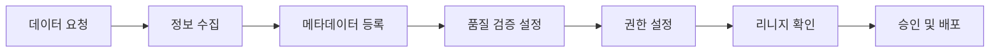

# 크래프트 데이터 거버넌스 프레임워크

## 📋 개요

**회사**: 크래프트테크놀로지스 (Qraft Technologies)
**적용 프로젝트**: [[qraft-data-platform-통합프로젝트|Qraft Data Platform 통합 프로젝트]]
**구축 기간**: 2025년 8월 ~ 현재

크래프트테크놀로지스에서 구현한 데이터 거버넌스 프레임워크는 **메타데이터 관리**, **데이터 품질**, **접근 제어**, **표준화**를 통합적으로 관리합니다.

**구축 배경**:
- 2025년 8월 입사 후 데이터 거버넌스 체계 전무 상태
- 팀별로 분산된 데이터 관리로 일관성 부족
- 데이터 품질 및 메타데이터 관리 프로세스 부재
- [[2025년-11월-24일|2025년 11월 24일]] DataHub 론칭으로 본격화

## 🎯 거버넌스 목표

### 1. 데이터 디스커버리
- 모든 데이터 자산을 쉽게 검색 가능
- 명확한 메타데이터 제공
- 데이터 리니지 투명화

### 2. 데이터 품질
- 자동화된 품질 검증
- 지속적인 품질 모니터링
- 이슈 추적 및 개선

### 3. 데이터 보안
- Role 기반 접근 제어
- 팀별 권한 관리
- 감사 로그 추적

### 4. 표준화
- 일관된 네이밍 컨벤션
- 데이터 모델 표준
- 문서화 표준

## 🏗️ 거버넌스 아키텍처

```
┌──────────────────────────────────────────────────────┐
│                  Governance Layer                     │
│                                                        │
│  ┌──────────────┐  ┌──────────────┐  ┌──────────────┐│
│  │   Metadata   │  │  Data Quality│  │Access Control││
│  │  Management  │  │  Management  │  │  Management  ││
│  └──────────────┘  └──────────────┘  └──────────────┘│
└──────────────────────────────────────────────────────┘
           ↓                  ↓                  ↓
┌──────────────────────────────────────────────────────┐
│                   Tool Layer                          │
│                                                        │
│     DataHub         DBT Tests       Keycloak          │
│  (Metadata Hub)   (Quality Check)  (Auth & RBAC)     │
└──────────────────────────────────────────────────────┘
           ↓                  ↓                  ↓
┌──────────────────────────────────────────────────────┐
│                   Data Layer                          │
│                                                        │
│    Airflow          DBT Models       Snowflake        │
│  (Orchestration)  (Transformation)  (Data Warehouse) │
└──────────────────────────────────────────────────────┘
```

## 🔧 거버넌스 구현

### 1. 메타데이터 관리

#### DataHub 기반 통합 카탈로그
**역할**: 모든 데이터 자산의 메타데이터 통합 관리

**수집 대상**:
- **Airflow**: DAG, Task 메타데이터
- **DBT**: 모델, 컬럼, 테스트 정보
- **Snowflake**: 테이블, 뷰, 스키마 정보

**메타데이터 구성**:
```yaml
Dataset:
  - name: 데이터셋 이름
  - description: 비즈니스 설명
  - schema: 컬럼 정의 및 타입
  - owners: 소유자 및 팀
  - tags: 분류 태그
  - domain: 비즈니스 도메인
  - lineage: 데이터 흐름
```

#### 리니지 추적
**목적**: 데이터 흐름 및 의존성 파악

**리니지 레벨**:
1. **Pipeline Level**: Airflow DAG → DBT → Snowflake
2. **Table Level**: 테이블 간 변환 관계
3. **Column Level**: 필드 간 매핑 관계

**활용**:
- Impact Analysis (변경 영향도 분석)
- Root Cause Analysis (오류 원인 추적)
- Compliance (데이터 출처 증명)

### 2. 도메인 및 태그 체계

#### 도메인 구조
```
Financial Markets (D)
├── Strategy (T)        # 전략팀
├── HFT (T)            # 고빈도거래팀
└── MFT (T)            # 중빈도거래팀

AI Products (D)
└── AI Product (T)     # AI 제품팀

Public Data (D)
└── Public             # 공용 데이터
```

**도메인 정의 원칙**:
- **Domain (D)**: 비즈니스 영역 단위
- **Team (T)**: 조직 단위, 소유권 명확화
- **Public**: 팀 구분 없는 공용 데이터

#### 태그 체계
**팀 태그**: `team:strategy`, `team:hft`, `team:mft`, `team:ai`
**기술 태그**: `airflow`, `dbt`, `snowflake`, `python`
**데이터 타입**: `raw`, `processed`, `mart`, `analytics`
**데이터 소스**: `vendor:refinitiv`, `vendor:factset`, `crawling`

**태그 사용 규칙**:
1. 팀 소유 데이터는 반드시 `team:*` 태그 할당
2. Public 데이터는 팀 태그 없이 `public` 태그만
3. 구매 데이터는 `vendor:*` 태그로 출처 명시
4. 처리 단계별 타입 태그 추가

### 3. 데이터 품질 관리

#### DBT Tests 기반 검증
**현재 구현**:
```yaml
# schema.yml
models:
  - name: fct_market_data
    tests:
      - dbt_utils.expression_is_true:
          expression: "price > 0"
    columns:
      - name: symbol
        tests:
          - unique
          - not_null
      - name: date
        tests:
          - not_null
          - relationships:
              to: ref('dim_calendar')
              field: date
```

**검증 항목**:
- **스키마 검증**: 컬럼 타입, Nullable
- **데이터 무결성**: Unique, Not Null, Foreign Key
- **비즈니스 규칙**: 값 범위, 포맷, 논리적 일관성
- **참조 무결성**: 테이블 간 관계

#### Great Expectations 통합 (계획)
**목표**: 더 정교한 데이터 품질 검증

**계획 기능**:
- 데이터 프로파일링
- 자동 Expectation 생성
- 품질 대시보드
- 이상 탐지

### 4. 접근 제어

#### Keycloak 기반 통합 인증
**SSO 통합**: Airflow, DataHub, Jira

**권한 계층**:
```
Realm: qraft
├── Groups (팀별)
│   ├── Strategy (T)
│   ├── HFT (T)
│   └── MFT (T)
├── Roles (역할별)
│   ├── Admin
│   ├── Developer
│   └── Viewer
└── Users (개인)
```

#### 플랫폼별 권한 관리

**Airflow**:
- DAG 단위 권한 제어
- Team 기반 필터링
- Keycloak 그룹 연동

**Snowflake**:
- Role 기반 접근 제어
- 스키마/테이블 단위 권한
- 팀별 Role 할당

**DataHub**:
- Domain 기반 접근 제어
- Team 기반 필터링
- Policy 자동화

### 5. 네이밍 컨벤션

#### 원천 데이터 (Raw)
**과제**: 벤더사마다 다른 네이밍 규칙

**진행 상황**: 표준화 논의 중
- [[원천-네이밍-룰-정하기]]

**고려사항**:
- 벤더사 원본 이름 보존 vs 표준화
- 스키마 네이밍: `raw_{vendor}_{category}`
- 테이블 네이밍: 벤더사 원본 or 변환

#### DBT 모델
**레이어별 Prefix**:
```
raw_*       # 원천 데이터 (Source)
stg_*       # Staging (기본 정제)
int_*       # Intermediate (중간 변환)
fct_*       # Fact 테이블
dim_*       # Dimension 테이블
vw_*        # View (뷰는 변경 금지)
```

**네이밍 패턴**:
```
{prefix}_{domain}_{entity}_{description}

예시:
- fct_strategy_market_daily      # 전략팀 일별 마켓 Fact
- dim_hft_instrument             # HFT팀 상품 Dimension
- int_public_price_normalized    # 공용 가격 중간 테이블
```

#### Airflow DAG
**네이밍 규칙**:
```
{team}_{source}_{entity}_{frequency}

예시:
- strategy_refinitiv_market_daily
- hft_lseg_tick_realtime
- public_fred_macro_weekly
```

## 📊 거버넌스 프로세스

### 1. 신규 데이터 온보딩



**체크리스트**:
- [ ] 데이터 출처 및 목적 명확화
- [ ] 비즈니스 설명 작성
- [ ] Owner 및 Team 할당
- [ ] Domain 및 Tag 설정
- [ ] 스키마 정의 및 검증
- [ ] DBT Tests 작성
- [ ] 접근 권한 설정
- [ ] DataHub 메타데이터 등록

### 2. 데이터 변경 관리

**변경 프로세스**:
1. **영향도 분석**: DataHub Lineage로 Downstream 확인
2. **리뷰 요청**: 관련 팀에 사전 공지
3. **테스트**: 변경 사항 검증
4. **배포**: 단계적 롤아웃
5. **모니터링**: 변경 후 품질 확인

**메타데이터 업데이트**:
```bash
# 1. DBT 변경
cd infrastructure/airflow/teams/qraft/dbt
# 모델 수정 및 테스트

# 2. Manifest 생성
dbt docs generate --target prod

# 3. S3 업로드
aws s3 cp target/manifest.json s3://qraft-origin/metadata/dbt/

# 4. DataHub Ingestion
# UI → Ingestion → dbt_qraft → Execute

# 5. 메타데이터 검증
cd infrastructure/datahub/environments/common/maintenance
python validate_metadata.py
```

### 3. 품질 모니터링

**일간 모니터링**:
- DBT Test 결과 확인
- DataHub 품질 지표 리뷰
- 이상 데이터 알림

**주간 리뷰**:
- 품질 이슈 분석
- Owner 누락 데이터셋 확인
- 메타데이터 완성도 검토

**월간 거버넌스 회의**:
- 품질 트렌드 리뷰
- 정책 개선 논의
- 표준 업데이트

## 🚨 거버넌스 이슈 및 해결

### 1. 용어 정의 불명확
**문제**: 데이터 셋, 도메인, 태그 기준이 모호

**해결**:
- Glossary 작성 (진행 중)
- 팀별 워크샵 개최
- 가이드 문서 배포

### 2. Public vs Team 데이터 구분
**원칙**:
- 팀 tag가 있는 asset = 해당 팀 소유
- 팀 tag 없는 asset = Public (모두 접근 가능)
- 구매 데이터(원천) = Public owner

### 3. 구매 vs 프로세싱 데이터 구분
**분류 기준**:
- **Data Product (구매)**: 벤더사로부터 구매한 원천 데이터
  - Owner: Public
  - Tag: `vendor:*`, `raw`

- **Processed Data**: 내부 가공 데이터
  - Owner: 해당 팀
  - Tag: `team:*`, `processed`

### 4. Airflow Task 메타데이터 상속
**원칙**: Task는 DAG 정보 상속
- DAG의 Domain → Task의 Domain
- DAG의 Tags → Task의 Tags
- DAG의 Owner → Task의 Owner (기본값)

## 📚 관련 문서

### 📋 메인 프로젝트
- [[qraft-data-platform-통합프로젝트|Qraft Data Platform 통합 프로젝트]] - 전체 프로젝트 개요

### 📖 거버넌스 & 품질
- [[Data-Quality-Management|데이터 품질 관리 프로세스]] - 품질 검증 및 모니터링 (본 문서와 상호 보완)
- [[Data-Modeling-Best-Practices|데이터 모델링 Best Practices]] - 모델링 표준
- [[데이터-권한|데이터 권한]] - 접근 제어 정책
- [[원천-네이밍-룰-정하기|원천 네이밍 룰 정하기]] - 네이밍 컨벤션
- [[데이터벤토-관리-방안|데이터 벤더 관리 방안]] - 벤더 데이터 관리

### 🔧 구현 기술
- [[DataHub|DataHub - 메타데이터 관리]] - 메타데이터 플랫폼 (거버넌스 핵심 도구)
- [[DBT|DBT]] - 데이터 변환 및 품질 검증
- [[Keycloak]] - SSO 통합 인증 및 권한 관리
- [[Airflow|Airflow]] - 파이프라인 오케스트레이션
- [[Snowflake]] - 데이터 웨어하우스

### 🗂 관련 프로젝트
- [[iceberg-+-datahub|Iceberg + DataHub]] - 테이블 포맷 통합
- [[ERD-작성|ERD 작성]] - 데이터 모델링
- [[dag권한-관리|DAG 권한 관리]] - Airflow 권한
- [[jira,-keycloak-권한-자동화|Jira, Keycloak 권한 자동화]] - 권한 자동화

### 📅 관련 회고
- [[2025년-11월-24일|2025년 11월 24일]] - DataHub 론칭 및 거버넌스 체계 수립

## 💡 Best Practices

### 메타데이터 관리
1. **설명 작성**: 비즈니스 용어로 명확히 작성
2. **Owner 할당**: 모든 데이터셋에 Owner 지정
3. **Tag 일관성**: 정의된 태그 체계 준수
4. **정기 업데이트**: 변경 사항 즉시 반영

### 데이터 품질
1. **테스트 우선**: 모델 작성 시 Tests 함께 작성
2. **점진적 개선**: 기본 검증부터 시작, 점차 확장
3. **모니터링 자동화**: 이상 탐지 자동 알림
4. **문서화**: 품질 이슈 및 해결 방법 기록

### 접근 제어
1. **최소 권한**: 필요한 최소 권한만 부여
2. **정기 리뷰**: 분기별 권한 검토
3. **자동화**: Keycloak 연동으로 수동 작업 최소화
4. **감사 로그**: 접근 기록 보존

### 표준화
1. **컨벤션 준수**: 정의된 네이밍 규칙 따르기
2. **리뷰 프로세스**: MR/PR 시 표준 검증
3. **자동 검증**: Pre-commit hook으로 강제
4. **교육**: 신규 팀원 온보딩 시 표준 교육

## 🎓 학습 및 인사이트

### 거버넌스의 가치
1. **디스커버리 시간 단축**: 찾고자 하는 데이터를 빠르게 발견
2. **데이터 신뢰도 향상**: 검증된 데이터만 사용
3. **협업 효율성**: 명확한 소유권과 책임
4. **컴플라이언스**: 규제 요구사항 준수

### 도전 과제
1. **문화적 변화**: 거버넌스를 부담이 아닌 가치로 인식
2. **지속적 관리**: 초기 설정보다 유지 관리가 중요
3. **균형**: 너무 엄격하면 생산성 저하, 느슨하면 품질 저하
4. **자동화**: 수동 프로세스 최소화

### 향후 계획
1. **Great Expectations 도입**: 더 정교한 품질 검증
2. **Data Observability**: 실시간 품질 모니터링
3. **자동화 확대**: Policy 기반 자동 거버넌스
4. **Glossary 강화**: 비즈니스 용어 체계화

---

**Framework Owner**: ML Platform Infrastructure Team
**Last Updated**: 2025-11-30
**Status**: Active Development

---

## 📎 Related

### 관련 프로젝트 (구현)
- [[qraft-data-platform-통합프로젝트]] - 전체 데이터 플랫폼 통합 프로젝트
- [[DataHub-도입-배경]] - DataHub 메타데이터 카탈로그 도입
- [[Keycloak-SSO-도입-배경]] - Keycloak 기반 접근 제어
- [[팀별-데이터-격리-체계-구축]] - 도메인 기반 권한 관리

### 관련 기술 문서
- [[03-Resources/Technology/DataHub/DataHub|DataHub]] - 메타데이터 관리 플랫폼
- [[03-Resources/Technology/Airflow/Keycloak-Airflow-인증-개념|Keycloak Airflow 인증]] - RBAC 접근 제어
- [[03-Resources/Technology/Snowflake/Snowflake-RBAC-가이드|Snowflake RBAC]] - Domain-based 권한 관리

### 관련 프로세스
- [[데이터-품질-관리-프로세스]] - 품질 관리 상세 프로세스
- [[데이터-구매--적재-요청-프로세스-정립]] - 데이터 구매 및 적재 프로세스

### 주간 회고 (거버넌스 여정)
- [[Experience/Weekly/2025년 8월 11일]] - 문제 인식 ("데이터 관리가 개판임" - CFO 비용 의구심)
- [[Experience/Weekly/2025년 10월 27일]] - 거버넌스 중요성 재확인 (팀 간 데이터 공유 저항)
- [[Experience/Weekly/2025년 11월 24일]] - DataHub 론칭 및 거버넌스 본격화
