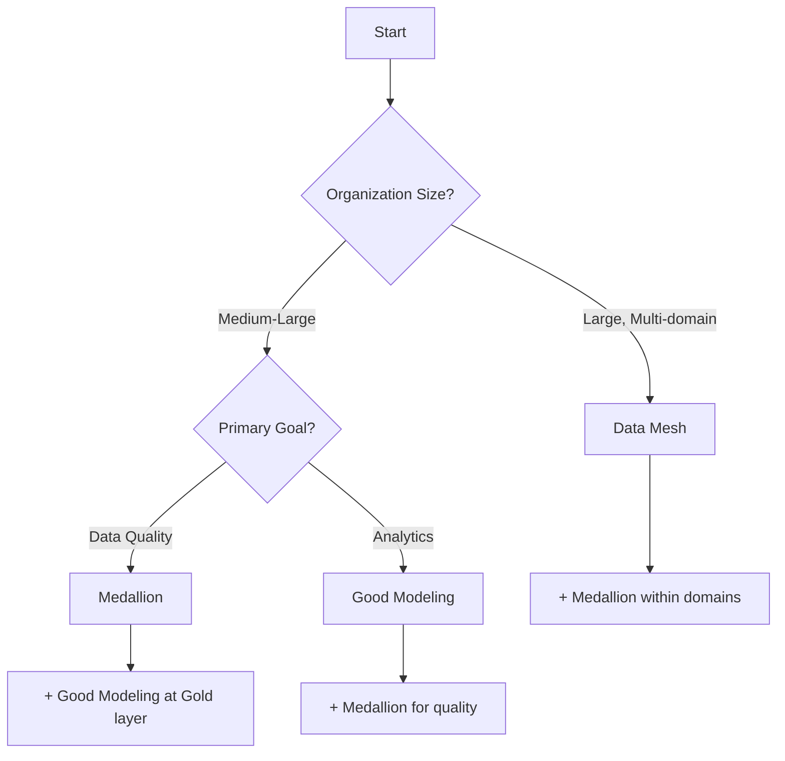

# Data Architecture Patterns

> 현대 데이터 아키텍처 패턴 및 베스트 프랙티스

## 📁 콘텐츠

### 아키텍처 패턴

#### [[data-mesh|Data Mesh]]
**분산형 데이터 아키텍처**
- Domain Ownership (도메인별 소유)
- Data as a Product (제품으로서의 데이터)
- Self-Serve Platform (셀프서브 플랫폼)
- Federated Governance (연합형 거버넌스)

**적용:**
- 대규모 조직
- 다수의 데이터 도메인
- 분산 팀 구조

---

#### [[data-medaillon|Medallion Architecture]]
**레이어 기반 데이터 정제**
- **Bronze**: Raw data (원본 그대로)
- **Silver**: Cleaned & validated (정제 및 검증)
- **Gold**: Business-level aggregates (비즈니스 집계)

**장점:**
- 명확한 데이터 품질 단계
- 추적 가능성
- 재사용성

**적용:**
- Data Lakehouse
- Modern Data Stack
- 점진적 데이터 정제

---

#### [[Data-Modeling-Best-Practices|Data Modeling Best Practices]]
**좋은 데이터 모델링 원칙**
- 계층적 설계 (Layered approach)
- Conformed Dimensions (일관된 차원)
- 명확한 Grain (세분성)
- Kimball Methodology

**핵심:**
- 소스 출처 명확화
- 차원 일관성
- 쿼리 최적화

---

## 🔗 Related

### Data Governance
- [[../Access-Control/]] - 접근 제어
- [[../../Technology/DataHub/]] - 메타데이터 관리

### Implementation
- [[../../Technology/DBT/]] - Transformation (Silver → Gold)
- [[../../Technology/Airflow/]] - Orchestration
- [[../../Technology/Snowflake/]] - Data Warehouse

### Use Cases
- [[../../../02-Areas/크래프트테크놀로지스/Projects/]] - 실제 프로젝트 적용

---

## 📊 Pattern Comparison

| Pattern | Scale | Governance | Complexity | Best For |
|---------|-------|------------|------------|----------|
| **Data Mesh** | Large | Federated | High | Multi-domain orgs |
| **Medallion** | Any | Centralized | Medium | Data quality focus |
| **Modeling BP** | Any | Centralized | Low-Medium | DWH design |

---

## 🎯 Selection Guide

---

## 📚 Further Reading

### Data Mesh
- Zhamak Dehghani's Book
- ThoughtWorks Articles
- [[data-mesh|Our Summary]]

### Medallion
- Databricks Documentation
- Data Lakehouse Principles
- [[data-medaillon|Our Summary]]

### Data Modeling
- Kimball Methodology
- Data Vault 2.0
- [[Data-Modeling-Best-Practices|Our Summary]]

---

**Last Updated:** 2025-11-29
**Status:** 🌲 Organized
**Total Patterns:** 3
