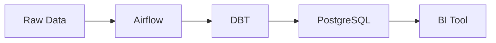

# DAE Second Brain 추천 플러그인

## ✅ 이미 설치됨

### 필수 플러그인
- ✅ **Dataview** - 동적 쿼리, 통계
- ✅ **Templater** - 강력한 템플릿 자동화
- ✅ **Calendar** - 캘린더 뷰
- ✅ **Obsidian Git** - 자동 백업
- ✅ **Tag Wrangler** - 태그 관리

---

## 🔥 강력 추천 (추가 설치)

### 1. **Excalidraw** ⭐⭐⭐⭐⭐
**용도**: 다이어그램, 아키텍처 설계

**왜 필요한가**:
- 데이터 파이프라인 아키텍처 그리기
- DAG 흐름도 작성
- 시스템 설계 스케치
- ERD (Entity Relationship Diagram)
- 회의 중 실시간 스케치

**사용 예시**:
```
Knowledge/Data-Architecture/
└── Diagrams/
    ├── Qraft-Pipeline-Architecture.excalidraw
    ├── Data-Mesh-Concept.excalidraw
    └── Airflow-DAG-Flow.excalidraw
```

**설치**: Community plugins → "Excalidraw" 검색

---

### 2. **Kanban** ⭐⭐⭐⭐⭐
**용도**: 프로젝트 관리, 할일 보드

**왜 필요한가**:
- 프로젝트 태스크 관리 (To Do / In Progress / Done)
- 스프린트 계획
- 버그 트래킹
- 학습 로드맵 시각화

**사용 예시**:
```markdown
## Projects/Active/Qraft-Pipeline.md

```kanban
- **To Do**
  - [ ] Airflow DAG 최적화
  - [ ] DBT 모델 리팩토링
- **In Progress**
  - [ ] PostgreSQL 성능 튜닝
- **Done**
  - [x] ECS 배포 완료
\```
```

**설치**: Community plugins → "Kanban" 검색

---

### 3. **Tasks** ⭐⭐⭐⭐
**용도**: 강력한 할일 관리

**왜 필요한가**:
- 모든 노트의 체크박스를 한곳에 모아 보기
- 우선순위 설정
- 마감일 추적
- 반복 작업 자동화

**Dataview와 차이**:
- Dataview: 쿼리 기반 (유연하지만 복잡)
- Tasks: 태스크 전용 (간단하고 강력)

**사용 예시**:
```markdown
## 오늘 할 일
- [ ] Airflow DAG 검토 📅 2025-11-28 ⏫
- [ ] DBT 문서 작성 📅 2025-11-29 🔼
```

**설치**: Community plugins → "Tasks" 검색

---

### 4. **Periodic Notes** ⭐⭐⭐⭐
**용도**: 일일/주간/월간 노트 자동화

**왜 필요한가**:
- Daily Notes만으로는 부족
- 주간 회고 자동 생성
- 월간 목표 트래킹
- 분기별 OKR 관리

**설정**:
- Daily: `Flow/Daily/YYYY-MM-DD.md`
- Weekly: `Flow/Weekly/YYYY-Wnn.md`
- Monthly: `Flow/Monthly/YYYY-MM.md`

**설치**: Community plugins → "Periodic Notes" 검색

---

### 5. **Graph Analysis** ⭐⭐⭐
**용도**: 지식 네트워크 분석

**왜 필요한가**:
- 어떤 노트가 가장 많이 연결되었나?
- 고립된 노트 찾기
- 지식 네트워크 시각화
- Hub 노트 효과 측정

**활용**:
- Concept → Experience → Pattern 연결 확인
- Hub 노트 중심성 분석

**설치**: Community plugins → "Graph Analysis" 검색

---

## 💡 유용한 플러그인 (선택)

### 6. **Obsidian Linter**
**용도**: 마크다운 자동 포맷팅

**설정 추천**:
- YAML 자동 정렬
- 헤딩 스타일 통일
- 불필요한 공백 제거
- 링크 포맷 통일

---

### 7. **Advanced Tables**
**용도**: 테이블 편집 개선

**기능**:
- Tab으로 셀 이동
- 자동 정렬
- 행/열 추가/삭제 단축키
- CSV import

**DAE 활용**:
- 데이터 샘플 테이블
- 비교표 작성
- 설정값 정리

---

### 8. **Paste URL into selection**
**용도**: 링크 삽입 간편화

**사용법**:
```
1. 텍스트 선택: "Airflow 공식 문서"
2. URL 복사
3. Ctrl+V
4. 결과: [Airflow 공식 문서](https://airflow.apache.org)
```

---

### 9. **QuickAdd**
**용도**: 빠른 노트 생성

**매크로 예시**:
- "새 Concept 생성" → 템플릿 선택 → 폴더 선택
- "문제 해결 기록" → Experience 노트 자동 생성
- "회의록 작성" → 날짜/참석자 자동 입력

---

### 10. **Note Refactor**
**용도**: 노트 분할/병합

**활용**:
- 긴 Daily Note → Experience/Concept로 분리
- 여러 노트 → Hub로 통합

---

### 11. **Commander**
**용도**: 커스텀 명령어 단축키

**설정 예시**:
- `Ctrl+Shift+A`: Airflow Hub 열기
- `Ctrl+Shift+P`: Python Hub 열기
- `Ctrl+Shift+D`: 오늘 Daily Note

---

### 12. **Folder Note**
**용도**: 폴더에 README 연결

**활용**:
```
Knowledge/Technology/Orchestration/
├── Orchestration.md (← 폴더 노트)
├── Concepts/
├── Experiences/
└── Patterns/
```

---

## 🎨 시각화 & 다이어그램

### 13. **Mermaid** (Built-in)
**용도**: 코드로 다이어그램 작성

**예시**:


---

### 14. **PlantUML** (선택)
**용도**: UML 다이어그램

**DAE 활용**:
- Sequence Diagram (데이터 흐름)
- Component Diagram (아키텍처)

---

## 📊 Dataview 쿼리 예시

### Hub별 노트 수
```dataview
TABLE
  length(file.inlinks) as "참조 횟수",
  length(file.outlinks) as "연결 노트"
FROM "Knowledge"
WHERE contains(file.name, "Hub")
SORT length(file.inlinks) DESC
```

### 최근 7일 작성 노트
```dataview
TABLE file.ctime as "생성일"
FROM ""
WHERE file.ctime >= date(today) - dur(7 days)
SORT file.ctime DESC
```

### 타입별 노트 통계
```dataview
TABLE
  length(rows) as "개수"
FROM ""
WHERE type
GROUP BY type
SORT length(rows) DESC
```

---

## 🎯 설치 우선순위

### 지금 당장 설치 (필수)
1. **Excalidraw** - 아키텍처 다이어그램
2. **Kanban** - 프로젝트 관리
3. **Periodic Notes** - 주간/월간 회고

### 1주일 내 설치 (강력 추천)
4. **Tasks** - 할일 관리
5. **Graph Analysis** - 네트워크 분석
6. **Advanced Tables** - 테이블 편집

### 필요시 설치 (선택)
7. **Paste URL into selection**
8. **QuickAdd**
9. **Commander**

---

## ⚙️ 플러그인 설정 팁

### Templater 설정
```
Settings → Templater
- Template folder: Templates
- Trigger on new file: ON
- Folder templates:
  - Knowledge/Technology/Orchestration/Concepts → concept-note.md
  - Knowledge/Technology/Orchestration/Experiences → experience-note.md
  - Knowledge/Technology/Orchestration/Patterns → pattern-note.md
```

### Calendar 설정
```
Settings → Calendar
- Weekly note format: YYYY-[W]ww
- Weekly note folder: Flow/Weekly
- Show week number: ON
```

### Dataview 설정
```
Settings → Dataview
- Enable JavaScript Queries: ON
- Enable Inline Queries: ON
```

---

## 🚫 설치하지 않아도 되는 것

### Notion-like Databases
- 이미 Dataview로 충분
- 복잡하고 무거움

### Mind Map 플러그인
- Excalidraw + Graph View로 대체 가능

### Fancy 테마/스타일링 플러그인
- 컨텐츠에 집중하는 게 중요

---

## 📝 설치 후 해야 할 일

### 1. Excalidraw 설치 후
- [ ] `Knowledge/Diagrams/` 폴더 생성
- [ ] Qraft 파이프라인 아키텍처 그리기
- [ ] Airflow DAG 예시 그리기

### 2. Kanban 설치 후
- [ ] `Projects/Active/` 각 프로젝트에 Kanban 추가
- [ ] 현재 진행 중인 태스크 정리

### 3. Periodic Notes 설치 후
- [ ] 주간 노트 템플릿 생성 (`Templates/weekly-note.md`)
- [ ] 월간 노트 템플릿 생성 (`Templates/monthly-note.md`)
- [ ] 이번 주 회고 작성

### 4. Tasks 설치 후
- [ ] Daily Note에 Tasks 쿼리 추가
- [ ] 모든 TODO 정리

---

*Last Updated: 2025-11-28*
*Recommended for: DAE (Data Analytics Engineer)*
